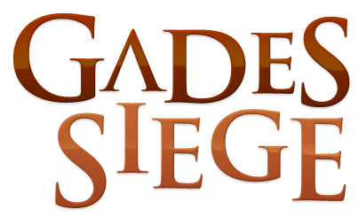

**Gades Siege** is an expanded version of the [Resistencia en Cádiz: 1812](https://forja.rediris.es/projects/cusl4-res-cadiz/) (now archived [here](ftp://ftp.rediris.com/sites/forja.rediris.es/forja/cusl4-res-cadiz/cusl4-res-cadiz/)) project by Pablo Recio. Gades Siege is a learning environment for rule-based expert systems, using a board game in a competitive format.

Gades Siege was part of the teaching innovation project _"La competitividad y el análisis crítico en la evaluación"_ (CIE44) at the [University of Cádiz](http://uca.es/) (Spain).

Development was also funded by the 2010 edition of the teaching innovation project call, titled _"Convocatoria 2010 de Proyectos de Innovación Educativa Universitaria para el PDI de la Universidad de Cádiz"_.

## Useful links ##
  * [Installation instructions](installation.html)
  * [Manual](manual.html)
  * [Team design](teamdesign.html)
  * [Example rules](examplerules.html)
  * [Use of Gades Siege in classrooms](classrooms.html)

## Screenshots ##

More screenshots are available [here](screenshots.html).

## Publications ##
  * [Betting system for formative code review in educational competitions](http://www.sciencedirect.com/science/article/pii/S0957417413007513), Expert Systems with Applications
  * [Competitive evaluation in a video game development course](http://dl.acm.org/citation.cfm?id=2325371) Annual Conference on Innovation and Technology in Computer Science Education
  * [Evaluación competitiva en el desarrollo de videojuegos](http://avanza.uca.es/evaltrends/images/stories/libros/LibroeradigDEF.pdf) EvalTrends
