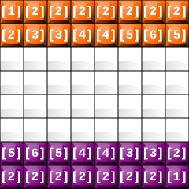

# Team design #

As mentioned before, the **data/teams** folder stores the various files that the teams are built from. Each team is made up of two files: a formation file, and a rules file.

## Formation file ##

Formation files define the initial position of the pieces for our expert system on the board. Previous versions used a Clips file for this, but later on we decided to use a simpler notation.

The formation file must be stored in **data/teams/formations**, and the name must follow the format **equipoName.form*, where _Name_ will be the identifier for your team. These are the contents of one possible formation file:

```
5:6:5:4:4:3:3:2
2:2:2:2:2:2:2:1
```

The file is made up of two lines of numbers separated by colons: these are the two rows where the pieces would be placed initially if the player started at the bottom half of the board. If the player started on the top half, the arrangement would be flipped vertically. The formation above would be arranged on the board as shown below:



Both teams have the same formation, but it can be flipped according to which side you are playing on.

## Rule file ##

Rule files define the conditions that the expert sytem will evaluate each turn to decide which action to take. These files are placed in **data/teams/rules**, and their names follow the format **reglasName.clp**, where _Name_ should match the identifier of the formation file.

Rule files are Clips scripts, hence their `.clp` extension and syntax. Each file should start with a comment that explains how our team works. Specifically, we can write a comment that Gades Siege will show in its UI while picking a team:

```
; DOC: here is the description of our rules file
```

We can still add comments anywhere else in the file, by starting a line with a semicolon.

All the rules follow a similar format:
```
(defrule EQUIPO-A::ruleName
  (declare (salience PRIORITY))
  (tiempo ?t)
  ; other conditions
  =>
  ; actions
)
```

The header for the rule specifies its **name** and **module**. Next is the **priority**: higher values indicate higher priorities, and the maximum value is 80. The next line is a matching condition that will tell us the current turn through the `?t` variable.
```
(defrule EQUIPO-A::attack1
  (declare (salience 30))
  (ficha (equipo "A") (num ?n1) (pos-x ?x1)
         (pos-y ?y1) (puntos ?p1))
  (ficha (equipo "B") (num ?n2) (pos-x ?x2)
         (pos-y ?y2) (puntos ?p2) (descubierta 1))
  (test (and (> ?p1 ?p2) (= ?y1 ?y2) (> ?x1 ?x2)))
  (tiempo ?t)
    =>
  (assert (mueve (num ?n1) (mov 2) (tiempo ?t)))
)
```

Line by line, the rule works as follows:

* `(defrule EQUIPO-A::atacar1`: header for the rule named `attack1` within module `EQUIPO-A`. You must use `EQUIPO-A` as your module name, due to implementation restrictions.
* `(declare (salience 30))`: priority in relation to the others.
* `(ficha (equipo "A") (num ?n1) (pos-x ?x1) (pos-y ?y1) (puntos ?p1))`: matches one of the pieces in our team, storing the positions in the various variables (`?n1`, `?x1`, `?y1`, and `?p1`) which we can use later.
* `(ficha (equipo "B") (num ?n2) (pos-x ?x2) (pos-y ?y2) (puntos ?p2) (descubierta 1))`: matches one of the pieces of the opponent, which must be uncovered (`(descubierta 1)`).
* `(test (and (> ?p1 ?p2) (= ?y1 ?y2) (> ?x1 ?x2)))`: checks that our piece has a higher value than the opponent's, that it is in the same column and that our piece is to the right of the opponent's.
* `(tiempo ?t)`: retrieves the current turn into the `t` variable.

If all these conditions are matched, the action block is executed.

`(assert (mueve (num ?n1) (mov 2) (tiempo ?t)))`: moves our piece towards the opponent's.

You can find some [example rules here](examplerules.html).

### Obstacles ###

Recent versions of Gades Siege can place **obstacles** on the board. The game engine will ignore rules that try to go through an obstacle, but ideally the rules themselves should avoid them. The `obstaculo` fact allows us to check if a certain position `(?x, ?y)` has an obstacle:
```
(obstaculo (pos-x ?x) (pos-y ?y))
```

These allow players to leverage obstacles for their strategies.

We can print all the obstacles at the beginning of the turn with this rule:
```
(defrule EQUIPO-A::printObstacles
  (declare (salience 70)) 
  (tiempo ?t)
  (obstaculo (pos-x ?x) (pos-y ?y))
  =>
  (printout t "OBSTACLE IN " ?x "," ?y crlf))
```
Since it does not move the pieces, it will not use up the turn.

### Dead pieces ###

While creating our strategy, we can know which pieces are dead with predicates such as:
```
(not (ficha (puntos 6)))
```

This works most of the time, but sometimes we will need more control. For instance, it might be useful to know **where** our 5 pieces died to avoid going that way, since it is likely there will be a 6 around that area. To enable this sort of strategy, we have created the `fichamuerta` fact, with the arguments below:
```
(fichamuerta (equipo ?e) (num ?n) (pos-x ?x) (puntos ?p) (pos-y ?y) (pos-y ?y))
```

We can use this rule to print each turn which pieces have died:
```
(defrule EQUIPO-A::printDead
  (declare (salience 70)) 
  (tiempo ?t) 
  (fichamuerta (equipo ?e) (num ?n) (puntos ?p) (pos-x ?x) (pos-y ?y))
  =>
  (printout t "Dead piece, team " ?e ", number " ?n ", worth " ?p ", " ?x "," ?y crlf))
```
As before, it does not move the pieces, so it does not use up the turn.

### Previous moves ###

Gades Siege keeps a history of all the moves made by a team. This history can be queried through this predicate:
```
(movio (equipo ?e) (num ?n) (puntos ?p) (turno ?tr) (mov ?m) (pos-x-ini ?x) (pos-y-ini ?y))
```

The predicate holds information about the team that owned the piece (`?e`), its identifier (`?n`) and value (`?p`), the turn in which it was moved (`?tr`), the type of movement (`?m`), and the initial X and Y position (`?x` and `?y`).

# Debugging #

When debugging your team, the most useful tool at our disposal is the PyClips logs in `clipsOutputFile`. This text file has all the information related to the match, with the game state at each turn.

You can print messages and values with the `printout` action:
```
(printout t "This is a message and the value of x is " ?x ". End of the message." crlf)
```

It must be noted that sometimes, the rule will be executed and the message will be printed, but the attempted move is illegal and it does not take effect. For instance, if our highest priority rule is moving forward a piece worth 2, it will keep doing that for every surviving 2-point piece until it finds one with no obstacles in front of it and the move can be done.

Ideally, you should **manually check** in your rules that the destination position is available, or that it has a weaker enemy in it.

